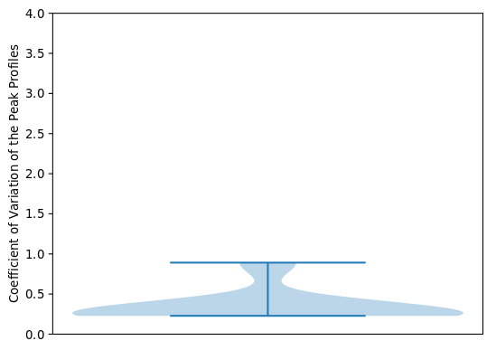
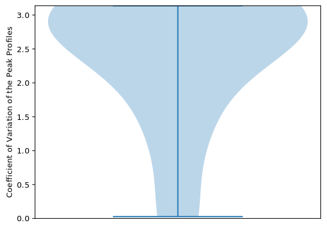
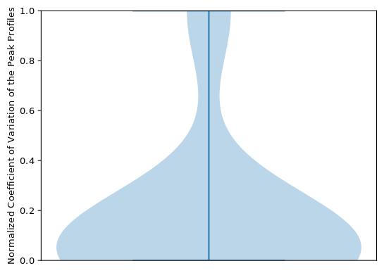
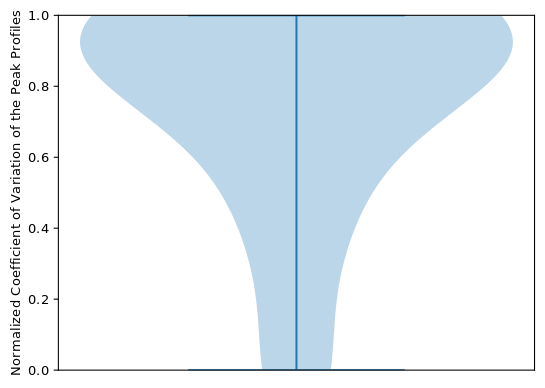
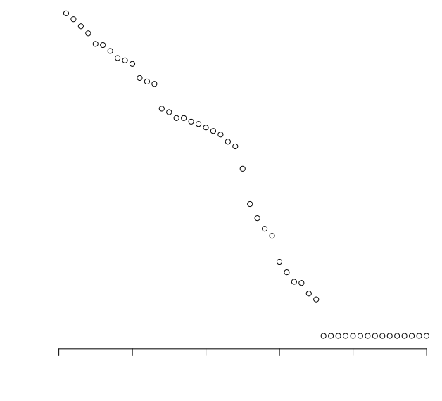
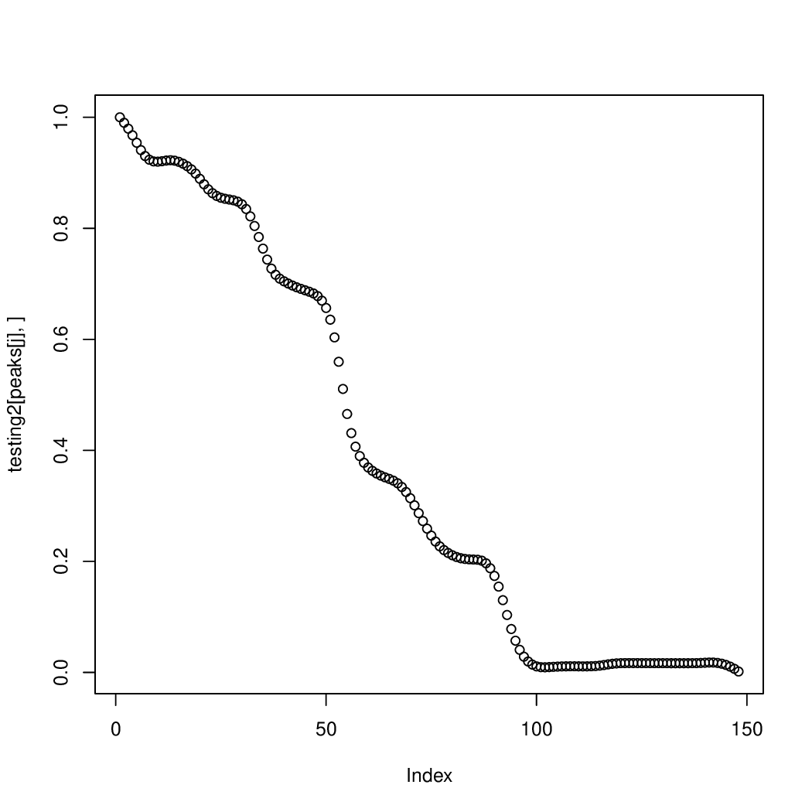
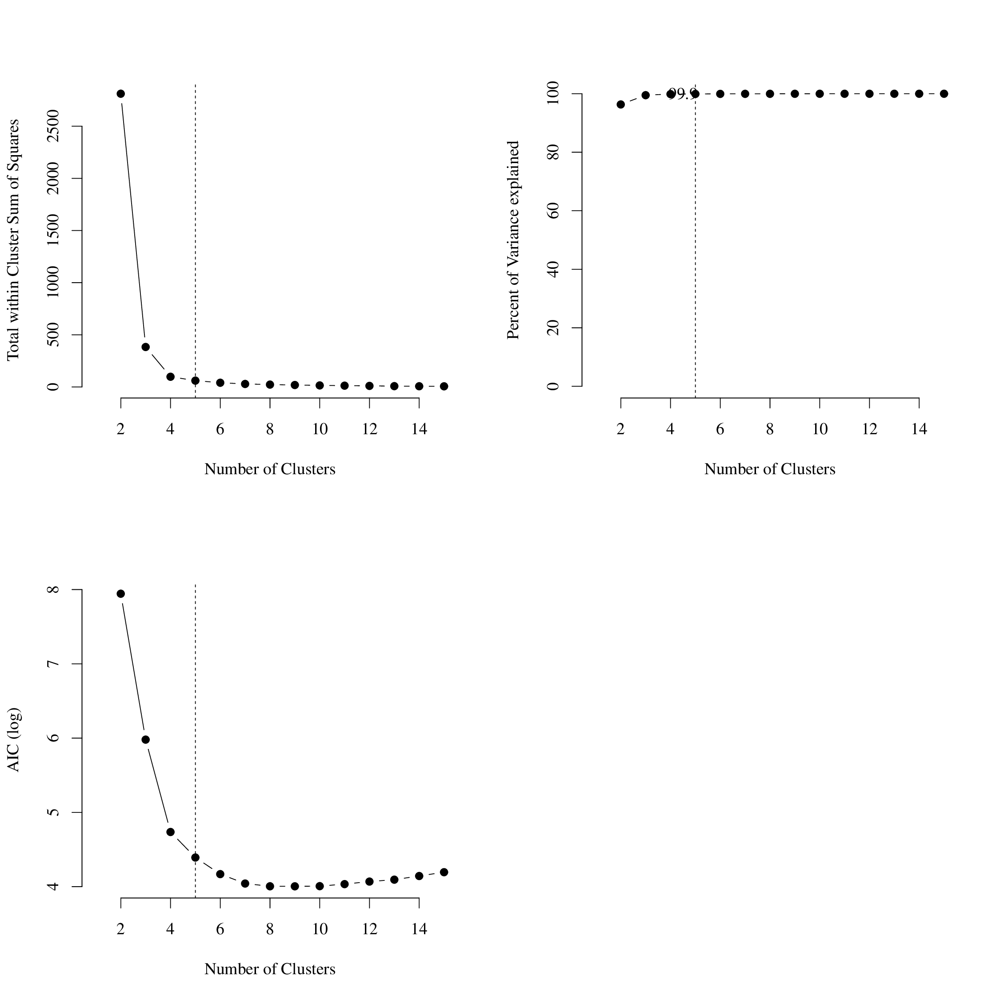
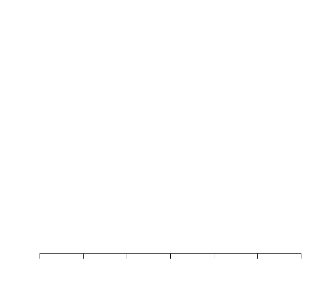

# StoatyDive

[](https://github.com/heylf/StoatyDive) [](https://anaconda.org/bioconda/stoatydive)
[](https://travis-ci.org/heylf/StoatyDive)

StoatyDive is a tool to evaluate and classify predicted peak profiles to assess the binding specificity of a protein to its targets.
It can be used for sequencing data such as CLIP-seq or ChIP-Seq, or any other type of peak profile data.

## Installation

You can install StoatyDive via conda or with a direct download
of this repository.

### Conda

```
conda install stoatydive
```

### Repository download

```
git clone https://github.com/heylf/StoatyDive.git
cd StoatyDive
sudo apt-get install -y r-base
python setup.py install
```

or

```
https://github.com/heylf/StoatyDive/archive/v1.0.3.tar.gz
```

Requirements: python >= 3.6, bedtools >= 2.27.1, numpy>=1.13.3, matplotlib>=2.1, scipy >= 1.3, R >= 3.4.4

## Usage

```
StoatyDive.py [-h] [options] -a *.bed -b *.bam/*bed -c *.txt
```

```
optional arguments:
  -h, --help            show this help message and exit
  -v, --version         show program's version number and exit
  -a *.bed, --input_bed *.bed
                        Path to the peak file in bed6 format.
  -b *.bam/*.bed, --input_bam *.bam/*.bed
                        Path to the read file used for the peak calling in bed
                        or bam format.
  -c *.txt, --chr_file *.txt
                        Path to the chromosome length file.
  -o path/, --output_folder path/
                        Write results to this path. [Default: Operating Path]
  -t float, --thresh float
                        Set a CV threshold to divide the peak profiles into
                        specific and unspecific. [Default: 1.0]
  --length_norm         Set length normalization. StoatyDive will expand every
                        peak to the maximal length.
  --length_norm_value int
                        Set length normalization value (maximum peak length).
  --max_norm_value float
                        Provide a maximum value for CV to make the normalized
                        CV plot more comparable.
  --border_penalty      Adds a penalty for non-centered peaks.
  --scale_max float     Provide a maximum value for the CV plot.
  --maxcl int           Maximal number of clusters of the kmeans clustering of
                        the peak profiles. The algorithm will be optimized,
                        i.e., the parameter is just a constraint and not
                        absolute. [Default: 15]
  --sm                  Turn on the peak profile smoothing for the peak
                        profile classification. It is recommended to turn it
                        on.
  --lam float           Parameter for the peak profile classification. Set
                        lambda for the smoothing of the peak profiles. A
                        higher value (> default) will underfit. A lower value
                        (< default) will overfit. [Default: 0.3]
  --turn_off_classification
                        Turn off the peak profile classification.
  --seed int            Set seed for the optimization scheme.
```

### Recommendations

#### Border Penalty and Length Normalization
It is recommended to use StoatyDive with `--border_penalty` and `--length_norm`.
Adding the border penalty takes care of peaks that are not correctly centered and might
just overlap with a short appendage of a read stack. The length normalization takes
care of different sized peaks. All peak are extended to a certain length with `--length_norm`. The user can either provide a peak length with `length_norm_value` or
StoatyDive just takes the maximal peak length of the given peak set.

#### Seed
Please set a seed if you use StoatyDive for any publications to warrant reproducible
results.

#### CV Threshold
The user can set a CV threshold with `-t, --thresh` to divide the predicted
peaks into more specific (0) and more unspecific sites (1). The default is set
to `1.0`.

#### Classification
StoatyDive runs uMAP and k-means clustering to classify the peak profiles.
You can skip this step with `--turn_off_classification`. The parameter `--maxcl`
is crucial for the k-means clustering. Just leave it in default, since the number
of clusters will be optimized internally. The parameter `--maxcl` is just an upper
bound. If you assume that 15 cluster is not enough then increase the parameter.

#### Smoothing of the Peak Profiles
StoatyDive can smooths the peak profiles, with a spline regression, using the
option `--sm`, which is recommended. This helps reduce the amount of noise. The
parameter `--lam` can be adjusted for your data. The default of `0.3` was optimized
with some test data. A higher value (> default) will underfit. A lower value (< default) will overfit.

#### Other options
- You can set a maximal value for the normalized CV distribution plot with `max_norm_value`. This option helps, if you want to compare several  normalized
CV distribution plots from different experiments. Take the highest CV from all experiments as a maximal value.
- You can set a maximal value for the  CV distribution plot with `scale_max`. This option helps, if you want to compare several normalized CV distribution plots from different experiments. Take the highest CV from all experiments as a maximal value.

## Quick Example

Example 1:
`StoatyDive.py -a test/broad_peaks/peaks.bed -b test/broad_peaks/reads.bed -c test/chrom_sizes.txt --length_norm --border_penalty --turn_off_classification -o test/broad_peaks/`

Example 2:
`StoatyDive.py -a test/sharp_peaks/peaks.bed -b test/sharp_peaks/reads.bed -c test/chrom_sizes.txt --length_norm --border_penalty --turn_off_classification -o test/sharp_peaks/`

Example 3:
`StoatyDive.py -a test/mixed_peaks/peaks.bed -b test/mixed_peaks/reads.bam -c test/chrom_sizes.txt --length_norm --length_norm_value 50 --border_penalty -o test/mixed_peaks/`

## Output

### CV distribution plot

| A        | B           |
| :-------------: |:-------------:|
|  |  |

The diagram will give you a first impression of the binding specificity of your
protein of interest. The diagram also tells you about the performance/quality
of your experiment. An experiment with lots of unspecific binding sites will have
a CV distribution close to zero, as in our example A. An experiment with lots
of specific binding sites will have a CV distribution with a high expected CV, as
in our example B.

### Normalized CV distribution plot

| A        | B           |
| :-------------: |:-------------:|
|  |  |

The normalized CV distribution helps to identify specific and unspecific sites within
an experiment. The normalized CV is in a range [0,1]. A specific site will have a value of 1. An unspecific site will have a value of 0.

## CV_tab file
The CV tabular file is a ranked, tab separated list of your predicted binding sites:
  1. Chromosome
  2. Start of Peak
  3. End of peak
  4. Peak ID/Name
  5. CV
  6. Strand
  7. Peak length
  8. r (hyperparameter of negative binomial)
  9. p (hyperparameter of negative binomial)
  10. Normalized CV
  11. Difference between the maximal value of the left border and the maximal
  value of the center region of the peak. (Penalty used for the border penalty.)
  12. Difference between the maximal value of the right border and the maximal
  value of the center region of the peak. (Penalty used for the border penalty.)
  13. Internal peak index
  14. Type of Peak: 0 = More specifc binding site; 1 = More unpsecific binding site.
  15. Class of the Peak (Cluster)

Use column `14` to divide your peak into the two general categories of
specific and unspecific. Use column `15` to find peaks with a specific shape.

## Clustering/Classification Results
You will get some plots for the classification, saved in the folder `clustering_*`.

### Cluster PDFs
| A        | B           |
| :-------------: |:-------------:|
|  |  |

If you turned on the smoothing you will get two types of cluster sets. One shows you
some example raw peak profiles assigned to the specific cluster (e.g. cluster_1.pdf     
for cluster 1; Figure A). One shows you some example smoothed peak profiles to the specific
cluster (e.g. cluster_smoothed1.pdf for cluster 1; Figure B).

### k-means Optimization


The plot `kmeans_Optimization.pdf` shows you the optimization scheme. If you data
has a very low complexity, that is to say, you have lots of similar peak profiles,
then the percent of variance explained will be very low (second plot). It is also
indicated by strong fluctuations in the other diagrams. If you have very distinguishable
peak profiles, as in our example, then the variance explained will be `> 90%`.

### uMAP Plot


The plot `uMAP.pdf` shows you the data in the new dimension found by the uMAP
dimensional reduction algorithm. In correspondance to the the k-means optimization,
highly distinguishable peaks will appear in the plot as very clearly separated
point clusters.
